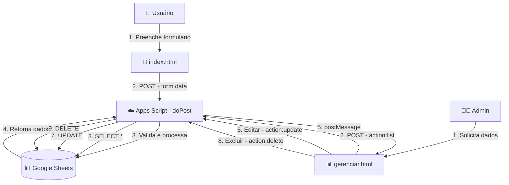

# 🛡️ Sistema de Registro de Violência Escolar

> Sistema web moderno e completo para registro, gerenciamento e acompanhamento de casos de violência escolar, com integração Google Sheets, painel administrativo avançado e sistema inteligente de tags.

<div align="center">


</div>

---

## 📋 Índice

- [Sobre o Projeto](#-sobre-o-projeto)
- [Funcionalidades](#-funcionalidades)
- [Demonstração Visual](#-demonstração-visual)
- [Tecnologias Utilizadas](#️-tecnologias-utilizadas)
- [Arquitetura do Sistema](#️-arquitetura-do-sistema)
- [Deploy Rápido](#-deploy-rápido)
- [Estrutura de Arquivos](#-estrutura-de-arquivos)
- [Guia de Uso](#-guia-de-uso)
- [Formato dos Dados](#-formato-dos-dados)
- [Atualização do Sistema](#-atualização-do-sistema)
- [Segurança](#-segurança)
- [FAQ](#-faq)
- [Suporte](#-suporte)

---

## 🎯 Sobre o Projeto

Sistema desenvolvido para a **Secretaria Municipal de Educação de Vitória/ES** para registro e acompanhamento de casos de violência escolar na rede municipal de ensino.

### 📊 Componentes Principais

| Componente | Arquivo | Descrição |
|------------|---------|-----------|
| **Formulário Público** | `index.html` | Interface para registro de novos casos |
| **Painel Administrativo** | `gerenciar.html` | Gestão completa dos registros |
| **Backend API** | `Code.gs` | API serverless no Google Apps Script |
| **Banco de Dados** | Google Sheets | Armazenamento de dados |

---

## ✨ Funcionalidades

### 📝 Formulário de Registro

#### 🎯 Recursos Inteligentes
- ✅ **Autocomplete para 106 escolas** - CMEIs e EMEFs da rede municipal
- ✅ **Sistema de tags para encaminhamentos** - Adicione múltiplos órgãos
- ✅ **Sugestões predefinidas** - Lista com 15 opções comuns
  - Conselho Tutelar, UBS, Delegacia, CRAS, CREAS, CAPS, Hospital, etc.
- ✅ **Validação em tempo real** - Feedback visual imediato
- ✅ **Conversão automática** de dados:
  - Datas: YYYY-MM-DD → DD/MM/YYYY
  - Gênero: Menino/Menina → M/F
  - Sim/Não → S/N
  - Nome escola → Sigla

#### 🎨 Interface
- 📱 **100% responsivo** (mobile, tablet, desktop)
- 🌈 Design moderno com gradientes
- ⚡ Animações suaves e transições
- ♿ Acessível e intuitivo

### 📊 Painel Administrativo

#### 📋 Gestão de Registros
- ✅ **Listagem completa** de todos os registros em tabela
- ✅ **Paginação inteligente**:
  - Opções: 10, 25, 50, 100, Todos
  - Navegação: ◀ 1 2 3 ... 14 ▶
  - Preserva página atual após editar/excluir
- ✅ **Busca em tempo real** por nome de estudante
- ✅ **Estatísticas dinâmicas**:
  - Total de registros
  - Registros exibidos na página

#### ✏️ Operações CRUD
- ✅ **Edição inline** com modal moderno
  - Todos os 18 campos editáveis
  - Conversão automática de dados
  - Auto-atualização após salvar (300ms)
- ✅ **Exclusão com confirmação**
  - Modal de confirmação elegante
  - Feedback visual de sucesso
- ✅ **Carregamento assíncrono** via postMessage (sem CORS)

#### 🎯 Recursos Avançados
- 🔄 **Auto-reload** após operações
- 🎯 **Preservação de estado** (página, filtros)
- ⚡ **Performance otimizada** para milhares de registros
- 🎨 **Badges coloridos** para status visuais

---

## 🎬 Demonstração Visual

### Formulário de Registro

```
┌─────────────────────────────────────────────┐
│   🛡️ SISTEMA DE REGISTRO DE VIOLÊNCIA      │
├─────────────────────────────────────────────┤
│ 👤 DADOS DO ESTUDANTE                       │
│  Nome: [________________]  Data: [____]     │
│  Idade: [__]  Gênero: [Menino ▼]           │
│  PCD: [Sim ▼]  Raça: [_________]           │
├─────────────────────────────────────────────┤
│ ⚠️  SITUAÇÃO DA VIOLÊNCIA                   │
│  Tipo: [Selecione... ▼]                     │
│  Encaminhamento: (sistema de tags)          │
│  ┌─────────────────────────────────────┐   │
│  │ 🏥 UBS  ×   📞 Cons. Tutelar  ×    │   │
│  └─────────────────────────────────────┘   │
│  [Digite para adicionar...]                 │
│  └ Conselho Tutelar                         │
│  └ Delegacia                                │
│  └ CRAS                                     │
├─────────────────────────────────────────────┤
│ 🏫 UNIDADE E REGIÃO                         │
│  Escola: [Digite para buscar... ▼]          │
│  Região: [Centro ▼]                         │
│  Responsável: [_________________]           │
├─────────────────────────────────────────────┤
│ ✅ PERGUNTAS ADICIONAIS                     │
│  Fonte: Escola? [Sim ▼]                     │
│  Ocorreu na escola? [Sim ▼]                 │
│  ...                                        │
├─────────────────────────────────────────────┤
│      [💾 Salvar Registro]                   │
└─────────────────────────────────────────────┘
```

### Painel Administrativo

```
┌─────────────────────────────────────────────────────────────┐
│   📊 PAINEL ADMINISTRATIVO                                  │
├─────────────────────────────────────────────────────────────┤
│ 🔍 [Buscar estudante...]          [🔄 Carregar Registros]  │
│                                                             │
│ 📄 Itens por página: [25 ▼]       Total: 338 | Exibindo: 25│
├─────────────────────────────────────────────────────────────┤
│ Nome          │Data      │Idade│Gênero│Violência │Ações    │
├───────────────┼──────────┼─────┼──────┼──────────┼─────────┤
│ João Silva    │01/12/2025│  12 │  M   │ Verbal   │ [✏️] [🗑️] │
│ Maria Santos  │30/11/2025│  10 │  F   │ Física   │ [✏️] [🗑️] │
│ Pedro Costa   │29/11/2025│  13 │  M   │Sexual    │ [✏️] [🗑️] │
│ ...           │...       │ ... │  ... │ ...      │ [✏️] [🗑️] │
├─────────────────────────────────────────────────────────────┤
│          ◀ Anterior  1  2  3  4  5  ...  14  Próximo ▶     │
└─────────────────────────────────────────────────────────────┘
```

---

## 🛠️ Tecnologias Utilizadas

### Frontend
| Tecnologia | Versão | Uso |
|------------|--------|-----|
| **HTML5** | - | Estrutura semântica |
| **CSS3** | - | Estilização moderna |
| **JavaScript** | ES6+ | Lógica e interatividade |
| **Tailwind CSS** | v3 (CDN) | Framework CSS utility-first |

### Backend
| Tecnologia | Tipo | Descrição |
|------------|------|-----------|
| **Google Apps Script** | Serverless | API backend (Node.js-like) |
| **Google Sheets API** | Database | Banco de dados (18 colunas) |

### Hospedagem
| Serviço | Custo | Capacidade |
|---------|-------|------------|
| **GitHub Pages** | 🆓 GRATUITO | Frontend ilimitado |
| **Google Apps Script** | 🆓 GRATUITO | 20.000 execuções/dia |
| **Google Sheets** | 🆓 GRATUITO | 10M células (~555k registros) |

**💰 Custo Total: R$ 0,00**

---

## 🏗️ Arquitetura do Sistema

### Fluxo de Dados



### Diagrama de Componentes

```
┌─────────────────────────────────────────────────────────┐
│                  CAMADA DE APRESENTAÇÃO                 │
│  ┌──────────────────────┐  ┌───────────────────────┐   │
│  │   index.html         │  │  gerenciar.html       │   │
│  │  (Formulário)        │  │  (Admin Panel)        │   │
│  │  - Autocomplete      │  │  - Tabela paginada    │   │
│  │  - Sistema de tags   │  │  - Busca real-time    │   │
│  │  - Validação         │  │  - CRUD completo      │   │
│  └──────────┬───────────┘  └───────────┬───────────┘   │
└─────────────┼──────────────────────────┼───────────────┘
              │ POST (form)              │ POST (JSON)
              │ multipart/form-data      │ application/json
              ↓                          ↓
┌─────────────────────────────────────────────────────────┐
│                    CAMADA DE APLICAÇÃO                  │
│  ┌──────────────────────────────────────────────────┐   │
│  │         Code.gs (Google Apps Script)             │   │
│  │  ┌────────────────────────────────────────────┐  │   │
│  │  │ doGet()  - Retorna lista via postMessage  │  │   │
│  │  │ doPost() - Roteador de ações              │  │   │
│  │  │   ├─ action: 'save'   → saveRegistro()    │  │   │
│  │  │   ├─ action: 'list'   → listarRegistros() │  │   │
│  │  │   ├─ action: 'update' → atualizarRegistro│  │   │
│  │  │   └─ action: 'delete' → excluirRegistro() │  │   │
│  │  └────────────────────────────────────────────┘  │   │
│  │                                                   │   │
│  │  Funções auxiliares:                             │   │
│  │  • converterSimNao()  • extrairSiglaEscola()    │   │
│  │  • formatarData()     • converterIdentidade()    │   │
│  └─────────────┬─────────────────────────────────────┘   │
└────────────────┼─────────────────────────────────────────┘
                 │ appendRow()
                 │ getRange().getValues()
                 │ setValues()
                 ↓
┌─────────────────────────────────────────────────────────┐
│                    CAMADA DE DADOS                      │
│  ┌──────────────────────────────────────────────────┐   │
│  │         Google Sheets (Planilha)                 │   │
│  │  ┌────────────────────────────────────────────┐  │   │
│  │  │ Página1 (18 colunas: A - R)               │  │   │
│  │  │                                            │  │   │
│  │  │ A: Criança/Estudante  │ J: Região         │  │   │
│  │  │ B: Data NT            │ K: Responsável    │  │   │
│  │  │ C: Idade              │ L-R: Perguntas S/N│  │   │
│  │  │ D: Gênero (M/F)       │                   │  │   │
│  │  │ E: PCD (S/N)          │                   │  │   │
│  │  │ F: Raça/Cor           │ Total: ~338       │  │   │
│  │  │ G: Tipo Violência     │ registros         │  │   │
│  │  │ H: Encaminhamento     │ (exemplo)         │  │   │
│  │  │ I: CMEI/EMEF (Sigla)  │                   │  │   │
│  │  └────────────────────────────────────────────┘  │   │
│  └──────────────────────────────────────────────────┘   │
└─────────────────────────────────────────────────────────┘
```

---

## 🚀 Deploy Rápido

### Pré-requisitos
- ✅ Conta Google (Gmail)
- ✅ Conta GitHub
- ✅ Navegador moderno (Chrome, Firefox, Edge)
- ✅ Git instalado (opcional, pode usar interface do GitHub)

### 🎯 3 Passos Simples

#### 1️⃣ Configure o Backend (5 minutos)

1. **Acesse**: https://script.google.com
2. **Novo projeto** → Nome: `Sistema-Violencia-Escolar`
3. **Cole o código** completo do arquivo `Code.gs`
4. **Salve** (Ctrl+S)
5. **Implantar** → Nova implantação → **App da Web**
   - Executar como: **Eu**
   - Quem tem acesso: **Qualquer pessoa**
6. **Autorize** o aplicativo
7. **📋 COPIE A URL** gerada (salve em local seguro!)

#### 2️⃣ Configure o Frontend (3 minutos)

**Em `index.html`** (linha ~924):
```javascript
const APPS_SCRIPT_URL = 'COLE_SUA_URL_AQUI';
```

**Em `gerenciar.html`** (linha ~373):
```javascript
const APPS_SCRIPT_URL = 'COLE_SUA_URL_AQUI';
```

#### 3️⃣ Publique no GitHub (2 minutos)

```bash
# Via Terminal
git add .
git commit -m "🚀 Deploy inicial do sistema"
git push

# Ativar GitHub Pages:
# Settings > Pages > Branch: main > folder: / (root) > Save
```

**🎉 Pronto!** Acesse:
- **Formulário**: `https://SEU-USUARIO.github.io/SEU-REPO/index.html`
- **Admin**: `https://SEU-USUARIO.github.io/SEU-REPO/gerenciar.html`

📖 **Guia completo detalhado**: [`DEPLOY-GITHUB.md`](./DEPLOY-GITHUB.md)

---

## 📁 Estrutura de Arquivos

```
sistema-registro-violencia/
│
├── 📄 index.html              # Formulário público (registro de casos)
│   └── Funcionalidades:
│       • Autocomplete de escolas (106 unidades)
│       • Sistema de tags para encaminhamentos
│       • Validação em tempo real
│       • Design responsivo com Tailwind CSS
│
├── 📄 gerenciar.html          # Painel administrativo (gestão de registros)
│   └── Funcionalidades:
│       • Listagem paginada (10/25/50/100/Todos)
│       • Busca em tempo real por nome
│       • Edição inline com modal
│       • Exclusão com confirmação
│       • Estatísticas dinâmicas
│
├── 📄 Code.gs                 # Backend (Google Apps Script)
│   └── Endpoints:
│       • doGet()  - Lista registros (GET)
│       • doPost() - CRUD operations (POST)
│       • Funções auxiliares de conversão
│
├── 📖 README.md               # Este arquivo (documentação principal)
├── 📖 DEPLOY-GITHUB.md        # Guia detalhado de deploy
└── 🚫 .gitignore              # Arquivos ignorados pelo Git
```

---

## 📖 Guia de Uso

### 📝 Formulário Público (`index.html`)

#### Passo a passo para registrar um caso:

1. **Acesse** a URL pública do formulário
2. **Preencha** os dados do estudante:
   - Nome completo
   - Data da notificação
   - Idade, gênero, raça/cor
   - Se é PCD ou tem transtorno

3. **Descreva** a situação de violência:
   - Selecione o tipo (física, verbal, sexual, etc.)
   - **Adicione encaminhamentos**:
     - Clique no campo
     - Digite ou selecione da lista
     - Pressione Enter ou clique na sugestão
     - Adicione quantos precisar (aparecem como tags)
     - Clique no × para remover

4. **Informe** unidade e região:
   - Digite o nome da escola (autocomplete)
   - Selecione a região
   - Nome do responsável pelo registro

5. **Responda** perguntas adicionais (Sim/Não)

6. **Clique** em "💾 Salvar Registro"

7. **Confirmação**: "✅ Registro salvo com sucesso!"

### 📊 Painel Administrativo (`gerenciar.html`)

#### Funcionalidades disponíveis:

**1. Carregar Registros**
```
Clique em [🔄 Carregar Registros]
→ Dados carregam via postMessage (sem CORS)
→ Aparecem na tabela paginada
```

**2. Buscar Registros**
```
Digite no campo de busca 🔍
→ Filtra em tempo real por nome do estudante
→ Atualiza contadores automaticamente
```

**3. Paginar Resultados**
```
Selecione itens por página: [10 ▼ 25 ▼ 50 ▼ 100 ▼ Todos]
Navegue: ◀ Anterior  1 2 3 ... 14  Próximo ▶
→ Estado preservado após editar/excluir
```

**4. Editar Registro**
```
Clique no ícone [✏️]
→ Modal abre com todos os 18 campos
→ Edite os dados necessários
→ [💾 Salvar Alterações]
→ Auto-reload em 300ms
→ Permanece na mesma página
```

**5. Excluir Registro**
```
Clique no ícone [🗑️]
→ Modal de confirmação aparece
→ [🗑️ Confirmar Exclusão]
→ Registro removido permanentemente
→ Auto-reload em 300ms
→ Permanece na mesma página
```

---

## 📊 Formato dos Dados

### Estrutura da Planilha (18 colunas)

| # | Coluna | Tipo | Formato | Exemplo |
|---|--------|------|---------|---------|
| **A** | Criança/Estudante | Texto | String | João Silva Santos |
| **B** | Data da NT | Data | DD/MM/YYYY | 01/12/2025 |
| **C** | Idade | Número | Inteiro | 12 |
| **D** | Identidade de Gênero | Char | M ou F | M |
| **E** | PCD/Transtorno | Char | S ou N | S |
| **F** | Raça/Cor | Texto | String | Parda |
| **G** | Tipo de Violência | Texto | String | Verbal, Física, Sexual |
| **H** | Encaminhamento | Texto | CSV | Conselho Tutelar, UBS, CRAS |
| **I** | CMEI/EMEF | Texto | Sigla | AMCC, JBM, PSV |
| **J** | Região | Texto | String | Centro, São Pedro |
| **K** | Responsável Registro | Texto | String | Maria Santos |
| **L** | Fonte: Escola | Char | S ou N | S |
| **M** | Violência na Escola Ocorreu | Char | S ou N | S |
| **N** | Profissional Autor | Char | S ou N | N |
| **O** | Estudante Autor | Char | S ou N | S |
| **P** | Violência Fora da Escola | Char | S ou N | N |
| **Q** | Ocorreu na Escola | Char | S ou N | S |
| **R** | Violência Informada | Char | S ou N | S |

### Conversões Automáticas

O sistema faz conversões entre frontend e backend:

| Campo | Frontend | Backend (Sheets) |
|-------|----------|------------------|
| **Gênero** | Menino / Menina | M / F |
| **Sim/Não** | Sim / Não | S / N |
| **Data** | YYYY-MM-DD | DD/MM/YYYY |
| **Escola** | Nome completo | Sigla |
| **Encaminhamento** | Tags separadas | CSV (vírgula) |

---

## 🔄 Atualização do Sistema

### Frontend (GitHub Pages)

```bash
# 1. Edite os arquivos localmente
# 2. Commit e push

git add index.html gerenciar.html
git commit -m "✨ feat: adiciona nova funcionalidade"
git push origin main

# GitHub Pages atualiza automaticamente em ~1 minuto
```

### Backend (Apps Script)

```
1. Acesse https://script.google.com
2. Abra seu projeto
3. Edite Code.gs
4. Salve (Ctrl+S)
5. Implantar > Gerenciar implantações
6. Clique no ícone ✏️ (Editar)
7. Versão: Nova versão
8. Implantar
9. Se a URL mudou, atualize nos arquivos HTML
```

### Versionamento

Seguimos [Semantic Versioning](https://semver.org/):

```
v2.1.0
│ │ │
│ │ └─ PATCH: Correções de bugs
│ └─── MINOR: Novas funcionalidades (retrocompatíveis)
└───── MAJOR: Mudanças incompatíveis
```

---

## 🔐 Segurança

### Medidas Implementadas

✅ **URL hash aleatória** do Apps Script (difícil de adivinhar)  
✅ **Validação de campos** obrigatórios no backend  
✅ **Sanitização de dados** antes de salvar  
✅ **Mode no-cors** para proteger dados sensíveis  
✅ **Conversão de dados** para formatos seguros  

### ⚠️ Limitações Atuais

❌ **Sem autenticação** - Qualquer pessoa com a URL pode acessar  
❌ **Sem controle de permissões** - Todos têm acesso total  
❌ **Sem auditoria** - Não registra quem fez alterações  

### 🔒 Recomendações para Produção

**1. Adicionar Autenticação por Token**

```javascript
// Em Code.gs
const TOKEN_SECRETO = 'SEU_TOKEN_SUPER_SECRETO_AQUI';

function doPost(e) {
  // Verificar token
  const dados = JSON.parse(e.parameter.data);
  if (dados.token !== TOKEN_SECRETO) {
    return ContentService.createTextOutput(JSON.stringify({
      success: false,
      message: 'Acesso não autorizado'
    })).setMimeType(ContentService.MimeType.JSON);
  }
  
  // ... resto do código
}
```

**2. Implementar Sistema de Login**

Use **Google Sign-In** ou **Firebase Authentication** para:
- Identificar usuários
- Restringir acesso ao painel admin
- Registrar log de alterações

**3. Criar Níveis de Permissão**

```javascript
const PERMISSOES = {
  'admin@escola.gov.br': ['read', 'write', 'delete'],
  'professor@escola.gov.br': ['read', 'write'],
  'visitante@escola.gov.br': ['read']
};
```

**4. Backup Automático**

Configure backup diário da planilha:
- File > Version history > Enable
- Ou: Apps Script para export automático

---

## ❓ FAQ

<details>
<summary><b>💰 O sistema é realmente gratuito?</b></summary>

**Sim, 100% gratuito!**

- GitHub Pages: Gratuito (100GB/mês)
- Apps Script: Gratuito (20.000 execuções/dia)
- Google Sheets: Gratuito (10M células)

**Sem custos ocultos. Sem cartão de crédito. Sem pegadinhas.**

</details>

<details>
<summary><b>☁️ Preciso criar projeto no Google Cloud Platform?</b></summary>

**NÃO!** 

Apenas:
1. Apps Script (gratuito, sem GCP)
2. Google Sheets (gratuito)

Não precisa de:
- ❌ Google Cloud Project
- ❌ Billing habilitado
- ❌ APIs específicas habilitadas
- ❌ Service accounts

</details>

<details>
<summary><b>📊 Quantos registros o sistema suporta?</b></summary>

**Capacidade do Google Sheets:**
- 10 milhões de células totais
- Com 18 colunas: **~555.000 registros**

**Performance:**
- Até 1.000 registros: Excelente
- 1.000 - 10.000: Muito boa
- 10.000+: Considere paginação no backend

</details>

<details>
<summary><b>📱 Funciona em celular/tablet?</b></summary>

**Sim!** O sistema é **100% responsivo**:

- 📱 Smartphones (320px+)
- 📱 Tablets (768px+)
- 💻 Desktops (1024px+)
- 🖥️ Telas grandes (1920px+)

Testado em:
- ✅ iOS Safari
- ✅ Android Chrome
- ✅ Chrome Desktop
- ✅ Firefox
- ✅ Edge

</details>

<details>
<summary><b>🔒 Como adicionar autenticação?</b></summary>

**Opção 1: Token simples (rápido)**

```javascript
// Frontend
const TOKEN = 'seu-token-secreto';
dados.token = TOKEN;

// Backend
if (dados.token !== 'seu-token-secreto') {
  return { success: false, message: 'Não autorizado' };
}
```

**Opção 2: Google Sign-In (recomendado)**

```html
<!-- Adicione no HTML -->
<script src="https://accounts.google.com/gsi/client"></script>
<div id="g_id_onload" data-client_id="YOUR_CLIENT_ID"></div>
```

**Opção 3: Firebase Auth (profissional)**

- Email/senha
- Google, Facebook, GitHub
- Phone authentication
- Controle de permissões

</details>

<details>
<summary><b>📤 Como exportar dados para Excel?</b></summary>

**Método 1: Direto do Google Sheets**
```
1. Abra a planilha
2. Arquivo > Download
3. Escolha:
   - Microsoft Excel (.xlsx)
   - CSV (.csv)
   - PDF
```

**Método 2: Via Apps Script (automático)**
```javascript
function exportarParaExcel() {
  const ss = SpreadsheetApp.openById('SEU_ID');
  const sheet = ss.getSheetByName('Página1');
  
  // Converte para blob Excel
  const blob = ss.getBlob().setName('backup.xlsx');
  
  // Envia por email ou salva no Drive
  DriveApp.createFile(blob);
}
```

**Método 3: API externa**
Use bibliotecas como:
- **SheetJS** (xlsx.js)
- **ExcelJS**
- **Papa Parse** (para CSV)

</details>

<details>
<summary><b>🌐 Funciona offline?</b></summary>

**Não. O sistema requer internet para:**

- ✅ Salvar dados no Google Sheets
- ✅ Carregar registros do banco
- ✅ Executar o Apps Script

**Para funcionar offline, seria necessário:**
- IndexedDB ou LocalStorage (frontend)
- Service Worker (PWA)
- Sincronização quando voltar online

*Planejado para versão futura.*

</details>

<details>
<summary><b>🔄 Como fazer backup dos dados?</b></summary>

**Backup Manual:**
```
Google Sheets > Arquivo > Fazer download > Excel/CSV
```

**Backup Automático (Apps Script):**
```javascript
function backupDiario() {
  const ss = SpreadsheetApp.openById('SEU_ID');
  const pasta = DriveApp.getFolderById('ID_PASTA_BACKUP');
  
  const hoje = Utilities.formatDate(new Date(), 'GMT-3', 'yyyy-MM-dd');
  const copia = ss.copy(`Backup ${hoje}`);
  
  pasta.addFile(DriveApp.getFileById(copia.getId()));
}

// Configure gatilho: Editar > Acionadores > Nova
// backupDiario() > Diariamente > 00:00-01:00
```

**Backup na Nuvem:**
- Google Drive (sincronização automática)
- Download local semanal
- Export para AWS S3 / Azure Blob

</details>

<details>
<summary><b>🐛 O que fazer se encontrar um bug?</b></summary>

**1. Verifique se é problema conhecido (FAQ)**

**2. Debugar localmente:**
```
- Console do navegador (F12)
- Apps Script > Execuções
- Verificar logs
```

**3. Abrir issue no GitHub:**
```
https://github.com/GabrielGaks/sistema-registro-violencia/issues/new

Inclua:
- Descrição do problema
- Passos para reproduzir
- Screenshots/logs
- Navegador e versão
```

**4. Contribuir com correção:**
```bash
git checkout -b fix/nome-do-bug
# Faça suas alterações
git commit -m "fix: corrige bug X"
git push origin fix/nome-do-bug
# Abra Pull Request
```

</details>

<details>
<summary><b>🚀 Como contribuir com o projeto?</b></summary>

**Contribuições são bem-vindas!**

1. **Fork** o repositório
2. **Clone** localmente
3. **Crie uma branch**: `git checkout -b feature/nova-funcionalidade`
4. **Faça suas alterações**
5. **Commit**: `git commit -m "feat: adiciona X"`
6. **Push**: `git push origin feature/nova-funcionalidade`
7. **Abra um Pull Request**

**Tipos de contribuições:**
- 🐛 Correção de bugs
- ✨ Novas funcionalidades
- 📝 Melhorias na documentação
- 🎨 Melhorias de UI/UX
- ⚡ Otimizações de performance
- 🔒 Melhorias de segurança

</details>

---

## 🆘 Suporte

### 🔍 Debug e Troubleshooting

#### 1. Console do Navegador
```
Pressione F12 > Aba Console
Procure por erros (texto vermelho)
```

#### 2. Logs do Apps Script
```
https://script.google.com
Seu projeto > Executar > Execuções
Veja logs detalhados de cada execução
```

#### 3. Verificar Configurações
```
✅ URL do Apps Script correta em APPS_SCRIPT_URL?
✅ ID da planilha correto em SHEET_ID?
✅ Nome da aba correto em SHEET_NAME?
✅ Deploy do Apps Script como "Qualquer pessoa"?
✅ GitHub Pages ativado?
```

### 🐛 Erros Comuns e Soluções

| Erro | Causa | Solução |
|------|-------|---------|
| `Configure a URL do Apps Script` | URL não configurada | Cole URL em `APPS_SCRIPT_URL` |
| `Acesso negado` | Deploy restrito | Apps Script > Implantar > "Qualquer pessoa" |
| `Dados não aparecem` | ID/aba incorreto | Verifique `SHEET_ID` e `SHEET_NAME` |
| `CORS Error` | Normal com no-cors | Ignore, dados foram salvos |
| `Função não encontrada` | Nome errado | Verifique nome da função no Code.gs |
| `Timeout` | Muitos dados | Adicione paginação no backend |

### 📞 Canais de Suporte

| Canal | Resposta | Uso |
|-------|----------|-----|
| 📖 **Documentação** | Imediato | Consultar guias |
| 🐛 **GitHub Issues** | 1-2 dias | Reportar bugs |
| 💬 **Discussions** | 1-3 dias | Dúvidas gerais |
| 📧 **Email** | 3-5 dias | Suporte direto |

### 📚 Recursos Úteis

- 📖 [Guia completo de deploy](./DEPLOY-GITHUB.md)
- 🔧 [Apps Script Documentation](https://developers.google.com/apps-script)
- 📊 [Google Sheets API](https://developers.google.com/sheets/api)
- 🎨 [Tailwind CSS Docs](https://tailwindcss.com/docs)
- 📱 [GitHub Pages Docs](https://docs.github.com/pt/pages)

---

## 📄 Licença

Este projeto está sob a licença **MIT**. Veja o arquivo [LICENSE](./LICENSE) para mais detalhes.

**Resumo da licença:**
- ✅ Uso comercial
- ✅ Modificação
- ✅ Distribuição
- ✅ Uso privado
- ⚠️ Sem garantia

---

## 🙏 Agradecimentos

Este sistema foi desenvolvido com dedicação para apoiar o combate à violência escolar e a proteção de crianças e adolescentes da rede municipal de ensino de Vitória/ES.

**Agradecimentos especiais:**
- 🏫 Secretaria Municipal de Educação de Vitória/ES
- 👨‍🏫 Profissionais da educação que utilizam o sistema
- 👨‍💻 Comunidade open-source
- 🌟 Todos que contribuíram com feedback

---

## 📊 Estatísticas do Projeto


---

<div align="center">

### 🛡️ Sistema de Registro de Violência Escolar v2.1

**Desenvolvido por [Gabriel Gaks](https://github.com/GabrielGaks)**

*Dezembro de 2025*

---

[](./DEPLOY-GITHUB.md)
[](https://github.com/GabrielGaks/sistema-registro-violencia/issues)
[](https://github.com/GabrielGaks/sistema-registro-violencia/issues)

---

**⭐ Se este projeto foi útil, considere dar uma estrela!**

**Made with ❤️ for education and children's safety**

</div>

## 📋 Índice

- [Sobre](#-sobre)
- [Funcionalidades](#-funcionalidades)
- [Demonstração](#-demonstração)
- [Tecnologias](#-tecnologias)
- [Arquitetura](#-arquitetura)
- [Deploy Rápido](#-deploy-rápido)
- [Estrutura do Projeto](#-estrutura-do-projeto)
- [Uso](#-uso)
- [Atualização](#-atualização)
- [Segurança](#-segurança)
- [FAQ](#-faq)
- [Suporte](#-suporte)

## 🎯 Sobre

Sistema desenvolvido para a Secretaria Municipal de Educação de Vitória/ES para registro e acompanhamento de casos de violência escolar na rede municipal de ensino.

### 📊 Componentes

- **Formulário Público** (`index.html`) - Registro de novos casos
- **Painel Administrativo** (`gerenciar.html`) - Gestão completa de registros
- **Backend** (`Code.gs`) - API no Google Apps Script
- **Banco de Dados** - Google Sheets

## ✨ Funcionalidades

### 📝 Formulário de Registro

- ✅ **Autocomplete inteligente** para 106 escolas (CMEIs e EMEFs)
- ✅ **Sistema de tags** para múltiplos encaminhamentos
- ✅ **Sugestões predefinidas** (Conselho Tutelar, UBS, Delegacia, etc.)
- ✅ **Validação em tempo real** com feedback visual
- ✅ **Design responsivo** (mobile, tablet, desktop)
- ✅ **Conversão automática** de dados (S/N, siglas, datas)

### 📊 Painel Administrativo

- ✅ **Listagem completa** de todos os registros
- ✅ **Paginação inteligente** (10/25/50/100/Todos por página)
- ✅ **Busca em tempo real** por nome de estudante
- ✅ **Edição inline** com modal moderno
- ✅ **Exclusão com confirmação**
- ✅ **Estatísticas** (total de registros, exibindo)
- ✅ **Preservação de página** após editar/excluir
- ✅ **Auto-atualização** após operações (300ms)

### 🎨 Interface

- 🎨 Design moderno com **Tailwind CSS**
- 🌈 Gradientes e animações suaves
- 📱 **100% responsivo**
- ♿ Acessível e intuitivo
- 🎭 Ícones SVG personalizados

## 🎬 Demonstração

```
📝 Formulário Público
┌─────────────────────────────┐
│ 👤 Dados do Estudante       │
│ ⚠️  Situação da Violência   │
│ 🏫 Unidade e Região          │
│ ✅ Perguntas Adicionais      │
│ 📋 [Salvar Registro]         │
└─────────────────────────────┘

📊 Painel Administrativo
┌─────────────────────────────┐
│ 🔍 [Buscar...]  [Carregar]  │
│ Itens: [25 ▼]  Total: 338   │
├─────────────────────────────┤
│ Nome    Data    Idade ...   │
│ João    01/12   12    [✏️][🗑️]│
│ Maria   30/11   10    [✏️][🗑️]│
├─────────────────────────────┤
│ ◀ 1 2 3 4 5 ... 14 ▶        │
└─────────────────────────────┘
```

## 🛠️ Tecnologias

### Frontend
- **HTML5** - Estrutura semântica
- **CSS3** - Estilização moderna
- **JavaScript Vanilla** - Lógica e interatividade
- **Tailwind CSS v3** - Framework CSS (CDN)

### Backend
- **Google Apps Script** - API serverless
- **Google Sheets** - Banco de dados

### Hospedagem
- **GitHub Pages** - Frontend (GRATUITO)
- **Google Apps Script** - Backend (GRATUITO)

**Custo total: R$ 0,00** 💰

## 🏗️ Arquitetura

```
┌─────────────────────────────────────────┐
│         GitHub Pages (Frontend)         │
│  ┌──────────────┐  ┌─────────────────┐ │
│  │ index.html   │  │ gerenciar.html  │ │
│  │ (Formulário) │  │ (Admin Panel)   │ │
│  └──────┬───────┘  └────────┬────────┘ │
└─────────┼──────────────────┼───────────┘
          │ POST              │ POST
          │ (form data)       │ (JSON)
          ↓                   ↓
┌─────────────────────────────────────────┐
│    Google Apps Script (Backend)         │
│  ┌──────────────────────────────────┐   │
│  │ doGet()  - Lista registros       │   │
│  │ doPost() - CRUD operations       │   │
│  │   ├─ save (form)                 │   │
│  │   ├─ list (admin)                │   │
│  │   ├─ update (admin)              │   │
│  │   └─ delete (admin)              │   │
│  └─────────────┬────────────────────┘   │
└────────────────┼─────────────────────────┘
                 │ appendRow()
                 │ getValues()
                 │ setValues()
                 ↓
┌─────────────────────────────────────────┐
│       Google Sheets (Database)          │
│  ┌──────────────────────────────────┐   │
│  │ Página1 (18 colunas)             │   │
│  │ A-R: Dados do registro           │   │
│  └──────────────────────────────────┘   │
└─────────────────────────────────────────┘
```

## 🚀 Deploy Rápido

### Pré-requisitos
- Conta Google (Gmail)
- Conta GitHub
- Navegador moderno

### 3 Passos Simples

#### 1️⃣ Configure o Backend (Apps Script)

```bash
1. Acesse: https://script.google.com
2. Novo projeto → "Sistema-Violencia-Escolar"
3. Cole o código de Code.gs
4. Salve (Ctrl+S)
5. Implantar > App da Web
   - Executar como: Eu
   - Acesso: Qualquer pessoa
6. COPIE A URL gerada
```

#### 2️⃣ Configure o Frontend

```javascript
// Em index.html e gerenciar.html, linha ~920:
const APPS_SCRIPT_URL = 'COLE_SUA_URL_AQUI';
```

#### 3️⃣ Publique no GitHub

```bash
git add .
git commit -m "Deploy inicial"
git push

# Ative GitHub Pages:
Settings > Pages > Branch: main > Save
```

**🎉 Pronto!** Acesse: `https://SEU-USUARIO.github.io/SEU-REPO/`

📖 **Guia completo**: [`DEPLOY-GITHUB.md`](./DEPLOY-GITHUB.md)

## 📁 Estrutura do Projeto

```
FormularioRegistroV2/
├── 📄 index.html           # Formulário público
├── 📄 gerenciar.html       # Painel administrativo  
├── 📄 Code.gs              # Backend (Apps Script)
├── 📖 README.md            # Documentação principal
├── 📖 DEPLOY-GITHUB.md     # Guia de deploy
└── 🚫 .gitignore           # Arquivos ignorados
```

## 📖 Uso

### Formulário Público (`index.html`)

```
1. Acesse a URL pública
2. Preencha os dados do estudante
3. Descreva a situação de violência
4. Adicione encaminhamentos (sistema de tags)
5. Clique em "Salvar Registro"
6. Confirmação: "✅ Registro salvo com sucesso!"
```

### Painel Administrativo (`gerenciar.html`)

```
1. Acesse gerenciar.html
2. Clique em "Carregar Registros"
3. Visualize todos os registros em tabela
4. Use busca para filtrar por nome
5. Edite registros (ícone ✏️)
6. Exclua registros (ícone 🗑️)
7. Navegue pelas páginas (◀ 1 2 3 ▶)
```

## 📊 Formato dos Dados

| # | Coluna | Tipo | Exemplo |
|---|--------|------|---------|
| A | Criança/Estudante | Texto | João Silva |
| B | Data da NT | DD/MM/YYYY | 01/12/2025 |
| C | Idade | Número | 12 |
| D | Identidade de Gênero | M/F | M |
| E | PCD/Transtorno | S/N | S |
| F | Raça/Cor | Texto | Parda |
| G | Tipo de Violência | Texto | Verbal |
| H | Encaminhamento | Texto | Conselho Tutelar, UBS |
| I | CMEI/EMEF | Sigla | AMCC |
| J | Região | Texto | Centro |
| K | Responsável | Texto | Maria Santos |
| L-R | Perguntas S/N | S/N | S, N, S, N, S, N, S |

**Total: 18 colunas (A-R)**

## 🔄 Atualização

### Frontend (GitHub Pages)

```bash
# Edite os arquivos localmente
git add .
git commit -m "feat: descrição da mudança"
git push

# GitHub Pages atualiza automaticamente
```

### Backend (Apps Script)

```
1. Edite Code.gs no Apps Script
2. Salve (Ctrl+S)
3. Implantar > Gerenciar implantações
4. Editar (ícone ✏️) > Nova versão
5. Implantar
6. COPIE A NOVA URL (se mudou)
```

## 🔐 Segurança

- ✅ URL do Apps Script é hash aleatório (difícil de adivinhar)
- ✅ Validação de campos obrigatórios no backend
- ✅ Sanitização de dados antes de salvar
- ✅ Modo `no-cors` para evitar exposição de dados
- ⚠️ Para acesso restrito, implemente autenticação no `Code.gs`

### Recomendações

```javascript
// Em Code.gs, adicione verificação de token:
const TOKEN_SECRETO = 'SEU_TOKEN_AQUI';

function doPost(e) {
  const token = e.parameter.token;
  if (token !== TOKEN_SECRETO) {
    return ContentService.createTextOutput('Acesso negado');
  }
  // ... resto do código
}
```

## ❓ FAQ

<details>
<summary><b>O formulário é gratuito?</b></summary>
Sim! 100% gratuito usando GitHub Pages + Apps Script.
</details>

<details>
<summary><b>Precisa criar projeto no Google Cloud?</b></summary>
NÃO! Apenas Apps Script + Sheets (ambos gratuitos).
</details>

<details>
<summary><b>Quantos registros suporta?</b></summary>
Google Sheets suporta 10 milhões de células. Com 18 colunas = ~555 mil registros.
</details>

<details>
<summary><b>Funciona offline?</b></summary>
Não. Requer conexão com internet para salvar no Google Sheets.
</details>

<details>
<summary><b>Posso adicionar autenticação?</b></summary>
Sim! Implemente verificação de token no Code.gs (veja seção Segurança).
</details>

<details>
<summary><b>Como exportar dados?</b></summary>
Direto do Google Sheets: Arquivo > Download > CSV/Excel.
</details>

## 🆘 Suporte

### Debug

```
1. Console do navegador (F12 > Console)
2. Apps Script > Executar > Execuções (ver logs)
3. Verifique URL do Apps Script nos arquivos
4. Verifique ID da planilha no Code.gs
```

### Erros Comuns

| Erro | Solução |
|------|---------|
| `Configure a URL...` | Cole URL do Apps Script em APPS_SCRIPT_URL |
| `Acesso negado` | No deploy, selecione "Qualquer pessoa" |
| `Dados não aparecem` | Verifique ID da planilha e nome da aba |
| `CORS Error` | Normal com no-cors, dados foram salvos |

### Contato

Para problemas técnicos:
1. Verifique [`DEPLOY-GITHUB.md`](./DEPLOY-GITHUB.md)
2. Veja logs do Apps Script (Execuções)
3. Abra issue no GitHub

## 📄 Licença

Este projeto é de uso interno da **Secretaria Municipal de Educação de Vitória/ES**.

## 🙏 Agradecimentos

Desenvolvido com dedicação para apoiar o combate à violência escolar e proteção de crianças e adolescentes da rede municipal de ensino de Vitória/ES.

---

<div align="center">

**Sistema de Registro de Violência Escolar** v2.1

Desenvolvido por Gabriel Gaks | Dezembro 2025

[📖 Documentação](./DEPLOY-GITHUB.md) • [🐛 Reportar Bug](https://github.com/GabrielGaks/sistema-registro-violencia/issues) • [✨ Solicitar Funcionalidade](https://github.com/GabrielGaks/sistema-registro-violencia/issues)

</div>
