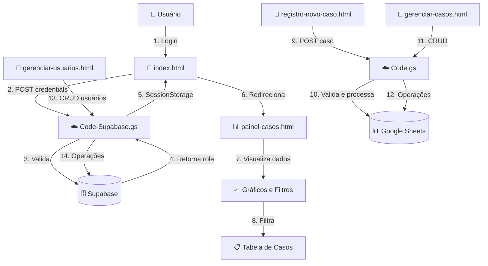

# 🛡️ Sistema de Registro de Violência Escolar

> Sistema web moderno e completo para registro, gerenciamento e acompanhamento de casos de violência escolar, com integração Google Sheets, Supabase, painel administrativo avançado com gráficos interativos, sistema de autenticação por roles e visualizações de dados em tempo real.

<div align="center">


**🌐 Sistema em Produção:** Sistema completo de gestão de casos de violência escolar

</div>

---

## 📋 Índice

- [Sobre o Projeto](#-sobre-o-projeto)
- [Funcionalidades Principais](#-funcionalidades-principais)
- [Tecnologias Utilizadas](#️-tecnologias-utilizadas)
- [Arquitetura do Sistema](#️-arquitetura-do-sistema)
- [Instalação e Configuração](#-instalação-e-configuração)
- [Estrutura de Arquivos](#-estrutura-de-arquivos)
- [Guia de Uso](#-guia-de-uso)
- [Sistema de Autenticação e Roles](#-sistema-de-autenticação-e-roles)
- [Painel de Casos e Gráficos](#-painel-de-casos-e-gráficos)
- [Formato dos Dados](#-formato-dos-dados)
- [Segurança e Variáveis de Ambiente](#-segurança-e-variáveis-de-ambiente)
- [Deploy no GitHub](#-deploy-no-github)
- [Atualização do Sistema](#-atualização-do-sistema)
- [FAQ](#-faq)
- [Suporte](#-suporte)
- [Changelog](#-changelog)

---

## 🎯 Sobre o Projeto

Sistema desenvolvido para a **Secretaria Municipal de Educação de Vitória/ES** para registro e acompanhamento de casos de violência escolar na rede municipal de ensino. O sistema oferece uma solução completa e moderna para gestão de dados, com interface intuitiva, gráficos interativos e controle de acesso baseado em roles.

### 📊 Componentes Principais

| Componente | Arquivo | Descrição |
|------------|---------|-----------|
| **Login** | `index.html` | Sistema de autenticação com Supabase |
| **Formulário de Registro** | `registro-novo-caso.html` | Interface para registro de novos casos |
| **Gerenciamento de Casos** | `gerenciar-casos.html` | Gestão completa dos registros (CRUD) |
| **Painel de Casos** | `painel-casos.html` | Dashboard com gráficos e visualizações |
| **Gerenciamento de Usuários** | `gerenciar-usuarios.html` | Gestão de usuários e permissões |
| **Backend Casos** | `backend/Code.gs` | API serverless no Google Apps Script |
| **Backend Auth** | `backend/Code-Supabase.gs` | API de autenticação e usuários |
| **Banco de Dados** | Google Sheets | Armazenamento de casos |
| **Autenticação** | Supabase | Sistema de usuários e roles |

---

## ✨ Funcionalidades Principais

### 🔐 Sistema de Autenticação

- ✅ **Login seguro** com Supabase
- ✅ **4 níveis de acesso** (superuser, admin, user, visualizador)
- ✅ **Controle de permissões** granular por role
- ✅ **Sessão persistente** com sessionStorage
- ✅ **Redirecionamento automático** baseado em role
- ✅ **Gerenciamento de usuários** completo (CRUD)

#### Roles e Permissões

| Role | Permissões |
|------|------------|
| **superuser** | Acesso total ao sistema (criar/editar/deletar qualquer usuário e caso) |
| **admin** | Gerenciar usuários (user e visualizador), criar/editar/deletar casos |
| **user** | Criar novos casos, editar/deletar próprios casos, visualizar painel |
| **visualizador** | Apenas visualização (read-only) do painel de casos |

### 📝 Formulário de Registro (`registro-novo-caso.html`)

#### 🎯 Recursos Inteligentes
- ✅ **Autocomplete para 106 escolas** - CMEIs e EMEFs da rede municipal
- ✅ **Sistema de tags para encaminhamentos** - Adicione múltiplos órgãos
- ✅ **Sugestões predefinidas** - Lista com 15+ opções comuns
  - Conselho Tutelar, UBS, Delegacia, CRAS, CREAS, CAPS, Hospital, etc.
- ✅ **Validação em tempo real** - Feedback visual imediato
- ✅ **Conversão automática** de dados:
  - Datas: YYYY-MM-DD → DD/MM/YYYY
  - Gênero: Menino/Menina → M/F
  - Sim/Não → S/N
  - Nome escola → Sigla (preserva siglas existentes)
- ✅ **Preservação de siglas** - Não sobrescreve siglas já existentes

#### 🎨 Interface
- 📱 **100% responsivo** (mobile, tablet, desktop)
- 🌈 Design moderno com gradientes e animações
- ⚡ Transições suaves entre páginas
- ♿ Acessível e intuitivo
- 🎭 Elementos visuais elegantes (glassmorphism, ripple effects, hovers)

### 📊 Painel Administrativo (`gerenciar-casos.html`)

#### 📋 Gestão de Registros
- ✅ **Listagem completa** de todos os registros em tabela
- ✅ **Paginação inteligente**:
  - Opções: 10, 25, 50, 100, Todos
  - Navegação: ◀ 1 2 3 ... 14 ▶
  - Preserva página atual após editar/excluir
- ✅ **Busca em tempo real** por nome de estudante
- ✅ **Estatísticas dinâmicas**:
  - Total de registros
  - Registros exibidos na página

#### ✏️ Operações CRUD
- ✅ **Edição inline** com modal moderno
  - Todos os 23 campos editáveis
  - Conversão automática de dados
  - Preservação de siglas existentes
  - Auto-atualização após salvar (100ms)
- ✅ **Exclusão com confirmação**
  - Modal de confirmação elegante
  - Feedback visual de sucesso
- ✅ **Carregamento otimizado** via iframe postMessage (sem CORS)
- ✅ **Performance melhorada** - Redução de logs e timeouts otimizados

### 📈 Painel de Casos (`painel-casos.html`)

#### 📊 Gráficos Interativos
- ✅ **Gráfico de Faixa Etária** - Distribuição por idade (0-5, 6-10, 11-14, 15-17, 18+)
- ✅ **Linha do Tempo por Mês** - Evolução temporal dos casos
- ✅ **Gráfico de Encaminhamentos** - Top 15 encaminhamentos mais frequentes
  - Agrupado por Redes (Assistência Social, Saúde, Educação, Conselho Tutelar, Segurança e Justiça, Outros)
  - Cores distintas por grupo
- ✅ **Autor da Violência** - Profissional da Escola, Estudante, Outro Agente
- ✅ **Ocorreu na Escola?** - Distribuição Sim/Não/Não Informado
- ✅ **Clique nos gráficos** - Filtra automaticamente a tabela de notificações

#### 🔍 Sistema de Filtros Avançados

**Filtros Rápidos (Cards Clicáveis):**
- 📍 Região
- ⚠️ Tipo de Violência
- 🏫 Tipo de Instituição (CMEI/EMEF)
- 🏢 Escola específica
- ⏱️ Tempo Integral (Sim/Não)
- 📋 Encaminhamento (agrupado por Redes)
- 👥 Raça/Cor
- ⚧️ Gênero
- ♿ Tipo de Deficiência/Transtorno
- 🌈 Orientação Sexual
- 🏷️ Classificação da Violência
- 🎯 Motivação da Violência

**Filtros Adicionais:**
- É PCD/tem deficiência (Sim/Não)
- Ocorreu na escola? (Sim/Não)
- Fonte informada (Sim/Não)
- Violência identificada pela escola ocorrida nela (Sim/Não)
- Profissional da escola foi autor (Sim/Não)
- Estudante foi autor (Sim/Não)
- Violência não ocorrida na escola (Sim/Não)
- Violência informada à escola (Sim/Não)
- **📋 Foi Realizado Estudo de Caso? (Sim/Não)** ⭐ NOVO
- Idade Mínima/Máxima
- Data Início/Fim
- Busca por nome

#### 🎯 Recursos do Painel
- ✅ **Filtros combinados** - Múltiplos filtros simultâneos
- ✅ **Badges de contagem** - Mostra quantos filtros estão ativos
- ✅ **Limpar filtros** - Botão para resetar todos os filtros
- ✅ **Tabela filtrada** - Atualização em tempo real
- ✅ **Estatísticas dinâmicas** - Atualizadas conforme filtros
- ✅ **Gráficos dinâmicos** - Atualizados conforme filtros
- ✅ **Interatividade** - Clique nos gráficos aplica filtros automaticamente

### 👥 Gerenciamento de Usuários (`gerenciar-usuarios.html`)

- ✅ **Listagem de usuários** com badges por role
- ✅ **Criar usuário** - Modal com validação
- ✅ **Editar usuário** - Atualização de email, senha e role
- ✅ **Excluir usuário** - Com confirmação
- ✅ **Filtros por role** - Admin vê apenas user e visualizador
- ✅ **Validação de permissões** - Admin não pode criar/editar admin ou superuser
- ✅ **Interface elegante** - Cards, modais e animações

### 🎨 Melhorias Visuais e UX

#### Transições Dinâmicas
- ✅ **Transições suaves** entre páginas
- ✅ **Overlay de loading** durante navegação
- ✅ **Animações de entrada/saída** (fade, blur, scale)
- ✅ **Sem flash de conteúdo** - Conteúdo oculto até animação iniciar

#### Estilos Elegantes (`styles-elegant.css`)
- ✅ **Glassmorphism** - Efeitos de vidro fosco
- ✅ **Ripple effects** - Efeitos de onda em botões
- ✅ **Hovers animados** - Elevação, shimmer, gradientes
- ✅ **Cards interativos** - Com sombras e transições
- ✅ **Badges rotativos** - Animações suaves
- ✅ **Scrollbar customizada** - Design elegante
- ✅ **Inputs com foco** - Scale e shadow
- ✅ **Tabelas responsivas** - Hover com gradiente

---

## 🛠️ Tecnologias Utilizadas

### Frontend
| Tecnologia | Versão | Uso |
|------------|--------|-----|
| **HTML5** | - | Estrutura semântica |
| **CSS3** | - | Estilização moderna |
| **JavaScript** | ES6+ | Lógica e interatividade |
| **Tailwind CSS** | v3 (CDN) | Framework CSS utility-first |
| **Chart.js** | v4.4.0 | Gráficos interativos |

### Backend
| Tecnologia | Tipo | Descrição |
|------------|------|-----------|
| **Google Apps Script** | Serverless | API backend (Node.js-like) |
| **Google Sheets API** | Database | Armazenamento de casos (23 colunas) |
| **Supabase** | Database/Auth | Sistema de autenticação e usuários |

### Hospedagem
| Serviço | Custo | Capacidade |
|---------|-------|------------|
| **GitHub Pages** | 🆓 GRATUITO | Frontend ilimitado |
| **Google Apps Script** | 🆓 GRATUITO | 20.000 execuções/dia |
| **Google Sheets** | 🆓 GRATUITO | 10M células (~555k registros) |
| **Supabase** | 🆓 GRATUITO | 500MB database, 50k usuários |

**💰 Custo Total: R$ 0,00**

---

## 🏗️ Arquitetura do Sistema

### Fluxo de Dados



### Diagrama de Componentes

```
┌─────────────────────────────────────────────────────────┐
│                  CAMADA DE APRESENTAÇÃO                 │
│  ┌──────────────┐  ┌──────────────┐  ┌──────────────┐  │
│  │ index.html   │  │ registro-    │  │ gerenciar-    │  │
│  │ (Auth)       │  │ novo-caso    │  │ casos.html   │  │
│  └──────┬───────┘  └──────┬───────┘  └──────┬───────┘  │
│         │                  │                  │          │
│  ┌──────┴───────┐  ┌──────┴───────┐  ┌──────┴───────┐  │
│  │ painel-      │  │ gerenciar-   │  │ styles-     │  │
│  │ casos.html   │  │ usuarios     │  │ elegant.css │  │
│  │ (Dashboard)  │  │ (Admin)      │  │ (Estilos)   │  │
│  └──────────────┘  └──────────────┘  └──────────────┘  │
└─────────────┼──────────────────────────┼─────────────────┘
              │ POST (JSON)              │ POST (JSON)
              ↓                          ↓
┌─────────────────────────────────────────────────────────┐
│                    CAMADA DE APLICAÇÃO                  │
│  ┌──────────────────────────────────────────────────┐   │
│  │ Code-Supabase.gs (Auth & Users)                 │   │
│  │  • realizarLogin()                              │   │
│  │  • listarUsuarios()                             │   │
│  │  • addUsuario()                                 │   │
│  │  • updateUsuario()                              │   │
│  │  • deleteUsuario()                              │   │
│  └─────────────┬────────────────────────────────────┘   │
│                │                                         │
│  ┌─────────────┴────────────────────────────────────┐   │
│  │ Code.gs (Casos)                                 │   │
│  │  • doGet()  - Lista registros                   │   │
│  │  • doPost() - CRUD operations                  │   │
│  │    ├─ action: 'save'   → saveRegistro()       │   │
│  │    ├─ action: 'list'   → listarRegistros()    │   │
│  │    ├─ action: 'update' → atualizarRegistro()  │   │
│  │    └─ action: 'delete' → excluirRegistro()     │   │
│  └─────────────┬────────────────────────────────────┘   │
└────────────────┼─────────────────────────────────────────┘
                 │
                 ├─→ Supabase (Auth & Users)
                 │
                 └─→ Google Sheets (Casos)
```

---

## 🚀 Instalação e Configuração

### Pré-requisitos

- ✅ Conta Google (Gmail)
- ✅ Conta GitHub
- ✅ Conta Supabase (gratuita)
- ✅ Navegador moderno (Chrome, Firefox, Edge, Safari)
- ✅ Git instalado (opcional)

### 📋 Passo a Passo Completo

#### 1️⃣ Configurar Supabase (Autenticação)

1. **Criar projeto no Supabase**
   - Acesse: https://supabase.com
   - Crie uma conta gratuita
   - Crie um novo projeto
   - Anote a URL e a chave anônima (anon key)

2. **Executar SQL de setup**
   - No Supabase Dashboard, vá em "SQL Editor"
   - Execute o conteúdo completo de `supabase-setup.sql`
   - Isso criará:
     - Tabela `app_users`
     - Enum `user_role` (superuser, admin, user, visualizador)
     - Políticas RLS (Row Level Security)
     - Funções auxiliares

3. **Criar primeiro usuário superuser**
   ```sql
   INSERT INTO app_users (email, password_text, role)
   VALUES ('seu-email@exemplo.com', 'sua-senha-segura', 'superuser');
   ```

#### 2️⃣ Configurar Google Apps Script (Backend)

**Projeto 1: Autenticação (`backend/Code-Supabase.gs`)**

1. Acesse: https://script.google.com
2. Novo projeto → Nome: `Sistema-Auth`
3. Cole o código completo de `backend/Code-Supabase.gs`
4. Configure as variáveis:
   ```javascript
   const SUPABASE_URL = 'https://seu-projeto.supabase.co';
   const SUPABASE_ANON_KEY = 'sua-chave-anon-aqui';
   ```
5. Salve (Ctrl+S)
6. **Implantar** → Nova implantação → **App da Web**
   - Executar como: **Eu**
   - Quem tem acesso: **Qualquer pessoa**
7. **📋 COPIE A URL** gerada

**Projeto 2: Casos (`backend/Code.gs`)**

1. Novo projeto → Nome: `Sistema-Casos`
2. Cole o código completo de `backend/Code.gs`
3. Configure as variáveis:
   ```javascript
   const SHEET_ID = 'ID_DA_SUA_PLANILHA';
   const SHEET_NAME = 'Página1';
   ```
4. Salve (Ctrl+S)
5. **Implantar** → Nova implantação → **App da Web**
   - Executar como: **Eu**
   - Quem tem acesso: **Qualquer pessoa**
6. **📋 COPIE A URL** gerada

#### 3️⃣ Configurar Google Sheets

1. **Criar planilha**
   - Acesse: https://sheets.google.com
   - Crie uma nova planilha
   - Nomeie a aba como "Página1"
   - Configure as colunas (veja seção "Formato dos Dados")

2. **Compartilhar com Apps Script**
   - Compartilhe a planilha com o email do Apps Script
   - Dê permissão de "Editor"

3. **Obter ID da planilha**
   - URL: `https://docs.google.com/spreadsheets/d/SEU_ID_AQUI/edit`
   - Copie o ID (parte entre `/d/` e `/edit`)

#### 4️⃣ Configurar Frontend

1. **Clone o repositório**
   ```bash
   git clone https://github.com/SEU-USUARIO/SEU-REPO.git
   cd FormularioRegistroV2
   ```

2. **Configure variáveis de ambiente**
   - Copie `.env.example` para `config.js` (ou crie `config.local.js`)
   - Preencha com suas credenciais:
   ```javascript
   const CONFIG = {
     APPS_SCRIPT_AUTH: 'URL_DO_APPS_SCRIPT_AUTH',
     APPS_SCRIPT_CASOS: 'URL_DO_APPS_SCRIPT_CASOS',
     SPREADSHEET_ID: 'ID_DA_PLANILHA',
     SUPABASE_URL: 'URL_DO_SUPABASE',
     SUPABASE_KEY: 'CHAVE_ANON_DO_SUPABASE'
   };
   ```

3. **⚠️ IMPORTANTE: Proteger Credenciais**
   - **NUNCA** faça commit de `config.js` com credenciais reais
   - Use `.gitignore` para proteger arquivos sensíveis
   - Para produção, use variáveis de ambiente ou GitHub Secrets

#### 5️⃣ Publicar no GitHub Pages

```bash
# Adicionar arquivos
git add .

# Commit inicial
git commit -m "🚀 Deploy inicial do sistema"

# Push para GitHub
git push origin main

# Ativar GitHub Pages:
# Settings > Pages > Branch: main > folder: / (root) > Save
```

**🎉 Pronto!** Acesse:
- **Login**: `https://SEU-USUARIO.github.io/SEU-REPO/index.html`
- **Formulário**: `https://SEU-USUARIO.github.io/SEU-REPO/registro-novo-caso.html`
- **Painel**: `https://SEU-USUARIO.github.io/SEU-REPO/painel-casos.html`

---

## 📁 Estrutura de Arquivos

```
FormularioRegistroV2/
│
├── 📄 index.html                    # Página de login
├── 📄 registro-novo-caso.html      # Formulário de registro
├── 📄 gerenciar-casos.html          # Gerenciamento de casos (CRUD)
├── 📄 painel-casos.html             # Dashboard com gráficos
├── 📄 gerenciar-usuarios.html       # Gerenciamento de usuários
│
├── 📜 config.js                     # Configurações centralizadas
├── 📜 config.local.example.js        # Template de configuração local
│
├── 📁 assets/                        # Recursos estáticos
│   ├── css/
│   │   └── styles-elegant.css       # Estilos compartilhados
│   └── js/
│       ├── modules/
│       │   └── dashboard-stats.js   # Estatísticas do dashboard
│       └── utils/
│           ├── api.js                # Módulo de API
│           ├── security.js           # Módulo de segurança
│           ├── logger.js             # Sistema de logging
│           ├── config-loader.js      # Carregador de config
│           └── page-transitions.js   # Transições entre páginas
│
├── 📁 backend/                        # Código do backend
│   ├── Code.gs                       # Backend - Casos (Google Apps Script)
│   └── Code-Supabase.gs              # Backend - Auth (Google Apps Script)
│
├── 📁 docs/                           # Documentação
│   ├── README.md                     # Este arquivo
│   ├── guides/                       # Guias de uso
│   ├── security/                     # Documentação de segurança
│   ├── troubleshooting/              # Solução de problemas
│   └── database/                     # Scripts SQL
│       ├── supabase-setup.sql        # SQL para configurar Supabase
│       └── password-reset-tokens.sql # SQL para reset de senha
│
└── 📁 legacy/                        # Arquivos legados
    └── Index-GoogleSheets.html       # Página inicial (legado)
│
├── 📖 README.md                     # Este arquivo (documentação principal)
├── 📖 DEPLOY-GITHUB.md             # Guia detalhado de deploy
├── 📖 .env.example                  # Exemplo de variáveis de ambiente
├── 🚫 .gitignore                    # Arquivos ignorados pelo Git
│
└── 📚 Documentação Adicional/
    ├── GUIA-IMPLANTACAO.md
    ├── CONFIG-README.md
    ├── GRUPOS-ENCAMINHAMENTO-GUIA.md
    └── TESTE-DEBUG.md
```

---

## 📖 Guia de Uso

### 🔐 Login (`index.html`)

1. **Acesse** a página de login
2. **Digite** email e senha
3. **Clique** em "Entrar"
4. **Redirecionamento automático** baseado no role:
   - **superuser/admin** → `gerenciar-usuarios.html`
   - **user** → `gerenciar-casos.html`
   - **visualizador** → `painel-casos.html`

### 📝 Registrar Novo Caso (`registro-novo-caso.html`)

1. **Preencha** os dados do estudante:
   - Nome completo
   - Data da notificação
   - Idade, gênero, raça/cor
   - Se é PCD ou tem transtorno

2. **Descreva** a situação de violência:
   - Selecione o tipo (física, verbal, sexual, etc.)
   - **Adicione encaminhamentos** (sistema de tags):
     - Digite ou selecione da lista
     - Pressione Enter ou clique na sugestão
     - Adicione quantos precisar

3. **Informe** unidade e região:
   - Digite o nome da escola (autocomplete)
   - Selecione a região
   - Nome do responsável pelo registro

4. **Responda** perguntas adicionais (Sim/Não)

5. **Clique** em "💾 Salvar Registro"

### 📊 Painel de Casos (`painel-casos.html`)

#### Visualizar Gráficos

1. **Carregue** um arquivo CSV ou conecte à planilha
2. **Visualize** os gráficos:
   - Faixa Etária
   - Linha do Tempo por Mês
   - Encaminhamentos (agrupados por Redes)
   - Autor da Violência
   - Ocorreu na Escola?

#### Aplicar Filtros

1. **Clique** nos cards de filtros rápidos
2. **Selecione** as opções desejadas
3. **Use** filtros adicionais (dropdowns)
4. **Observe** a tabela atualizar em tempo real
5. **Clique** em "🔄 Limpar Filtros" para resetar

#### Interagir com Gráficos

1. **Clique** em qualquer segmento do gráfico
2. **Filtro aplicado automaticamente** na tabela
3. **Badges atualizados** com contagem
4. **Rolagem automática** para a tabela

### 🔧 Gerenciar Casos (`gerenciar-casos.html`)

1. **Carregar registros**
   - Clique em "🔄 Carregar Registros"
   - Aguarde o carregamento (8s timeout)

2. **Buscar**
   - Digite no campo de busca
   - Filtra em tempo real por nome

3. **Editar**
   - Clique no ícone ✏️
   - Modal abre com todos os campos
   - Edite e clique em "💾 Salvar Alterações"

4. **Excluir**
   - Clique no ícone 🗑️
   - Confirme a exclusão

### 👥 Gerenciar Usuários (`gerenciar-usuarios.html`)

1. **Criar usuário**
   - Clique em "➕ Adicionar Usuário"
   - Preencha email, senha e role
   - Clique em "💾 Salvar"

2. **Editar usuário**
   - Clique no ícone ✏️
   - Edite os campos
   - Clique em "💾 Salvar Alterações"

3. **Excluir usuário**
   - Clique no ícone 🗑️
   - Confirme a exclusão

**⚠️ Restrições:**
- Admin não pode criar/editar admin ou superuser
- Admin pode gerenciar apenas user e visualizador
- Superuser tem acesso total

---

## 🔐 Sistema de Autenticação e Roles

### Estrutura de Roles

```sql
CREATE TYPE user_role AS ENUM (
  'superuser',    -- Acesso total
  'admin',        -- Gerencia users e visualizadores
  'user',         -- Acesso básico (criar/editar casos)
  'visualizador'  -- Apenas visualização (read-only)
);
```

### Permissões por Role

| Operação | superuser | admin | user | visualizador |
|----------|-----------|-------|------|--------------|
| **Criar casos** | ✅ | ✅ | ✅ | ❌ |
| **Editar casos** | ✅ | ✅ | ✅ (próprios) | ❌ |
| **Excluir casos** | ✅ | ✅ | ✅ (próprios) | ❌ |
| **Visualizar painel** | ✅ | ✅ | ✅ | ✅ |
| **Criar usuários** | ✅ | ✅ (user/visualizador) | ❌ | ❌ |
| **Editar usuários** | ✅ | ✅ (user/visualizador) | ✅ (próprio) | ❌ |
| **Excluir usuários** | ✅ | ❌ | ❌ | ❌ |
| **Gerenciar usuários** | ✅ | ✅ (user/visualizador) | ❌ | ❌ |

### Fluxo de Autenticação

1. **Login** → Validação no Supabase
2. **SessionStorage** → Armazena role e email
3. **Verificação** → Cada página verifica autenticação
4. **Redirecionamento** → Baseado em role
5. **Logout** → Limpa sessionStorage e redireciona

---

## 📈 Painel de Casos e Gráficos

### Gráficos Disponíveis

#### 1. Faixa Etária
- **Tipo**: Pizza (Pie Chart)
- **Categorias**: 0-5, 6-10, 11-14, 15-17, 18+ anos
- **Interatividade**: Clique filtra por faixa etária

#### 2. Linha do Tempo por Mês
- **Tipo**: Linha (Line Chart)
- **Eixo X**: Meses/Anos
- **Eixo Y**: Quantidade de casos
- **Interatividade**: Clique em um ponto filtra por mês

#### 3. Encaminhamentos
- **Tipo**: Barras Horizontais (Horizontal Bar Chart)
- **Top 15** encaminhamentos mais frequentes
- **Agrupamento**: Por Redes
  - 🏥 Assistência Social (CRAS, CREAS, etc.)
  - 🏥 Saúde (UBS, CAPS, Hospital, etc.)
  - 🎓 Educação (Escola, Secretaria, etc.)
  - 🛡️ Conselho Tutelar
  - ⚖️ Segurança e Justiça (Delegacia, etc.)
  - 📋 Outros
- **Interatividade**: Clique filtra por encaminhamento

#### 4. Autor da Violência
- **Tipo**: Pizza (Pie Chart)
- **Categorias**:
  - Profissional da Escola (coluna R = 'S')
  - Estudante (coluna S = 'S')
  - Outro Agente (R = 'N' e S = 'N')
  - Não Informado
- **Interatividade**: Clique filtra por autor

#### 5. Ocorreu na Escola?
- **Tipo**: Pizza (Pie Chart)
- **Categorias**: Sim, Não, Não Informado
- **Lógica**: Combina colunas `ocorreu` e `violenciaEscolaOcorreu`
- **Interatividade**: Clique filtra por ocorrência

### Sistema de Filtros

#### Filtros Rápidos (Cards)
- Cards clicáveis com ícones
- Badges de contagem quando ativos
- Seções expansíveis

#### Filtros Adicionais
- Dropdowns para Sim/Não
- Inputs para idade e data
- Busca por nome

#### Funcionalidades
- ✅ **Múltiplos filtros simultâneos**
- ✅ **Badges de contagem** por filtro
- ✅ **Limpar todos** os filtros
- ✅ **Atualização em tempo real** da tabela
- ✅ **Gráficos dinâmicos** conforme filtros
- ✅ **Clique nos gráficos** aplica filtros

---

## 📊 Formato dos Dados

### Estrutura da Planilha (23 colunas)

| # | Coluna | Tipo | Formato | Exemplo |
|---|--------|------|---------|---------|
| **A** | Criança/Estudante | Texto | String | João Silva Santos |
| **B** | Data da NT | Data | DD/MM/YYYY | 01/12/2025 |
| **C** | Idade | Número | Inteiro | 12 |
| **D** | Identidade de Gênero | Char | M ou F | M |
| **E** | PCD/Transtorno | Char | S ou N | S |
| **F** | Qual o Transtorno? | Texto | String | TDAH, Autismo |
| **G** | Raça/Cor | Texto | String | Parda |
| **H** | Orientação Sexual | Texto | String | Heterossexual |
| **I** | Classificação da Violência | Texto | String | Física |
| **J** | Tipo de Violência | Texto | String | Verbal, Física |
| **K** | Motivação da Violência | Texto | String | Bullying |
| **L** | Encaminhamento | Texto | CSV | Conselho Tutelar, UBS |
| **M** | CMEI/EMEF | Texto | Sigla | AMCC |
| **N** | Região | Texto | String | Centro |
| **O** | Responsável Registro | Texto | String | Maria Santos |
| **P** | Fonte: Escola | Char | S ou N | S |
| **Q** | Violência Escola Ocorreu | Char | S ou N | S |
| **R** | Profissional Autor | Char | S ou N | N |
| **S** | Estudante Autor | Char | S ou N | S |
| **T** | Violência Não Escola | Char | S ou N | N |
| **U** | Ocorreu na Escola | Char | S ou N | S |
| **V** | Violência Informada | Char | S ou N | S |
| **W** | Estudo de Caso | Char | S ou N | S |

### Conversões Automáticas

| Campo | Frontend | Backend (Sheets) |
|-------|----------|------------------|
| **Gênero** | Menino / Menina | M / F |
| **Sim/Não** | Sim / Não | S / N |
| **Data** | YYYY-MM-DD | DD/MM/YYYY |
| **Escola** | Nome completo | Sigla (preservada se já existir) |
| **Encaminhamento** | Tags separadas | CSV (vírgula) |

---

## 🔒 Segurança e Variáveis de Ambiente

### ⚠️ Proteção de Credenciais

**NUNCA faça commit de credenciais reais no GitHub!**

#### Arquivos Protegidos (`.gitignore`)

```
config.js              # Configurações com credenciais
config.local.js        # Configurações locais
.env                   # Variáveis de ambiente
.env.local             # Variáveis locais
Code-Supabase.gs       # Contém URLs e chaves
*.gs.bak               # Backups do Apps Script
```

#### Configuração Segura

**Opção 1: Arquivo Local (Desenvolvimento)**
```javascript
// Crie config.local.js (adicionado ao .gitignore)
const CONFIG = {
  APPS_SCRIPT_AUTH: 'sua-url-aqui',
  APPS_SCRIPT_CASOS: 'sua-url-aqui',
  SPREADSHEET_ID: 'seu-id-aqui',
  SUPABASE_URL: 'sua-url-aqui',
  SUPABASE_KEY: 'sua-chave-aqui'
};
```

**Opção 2: Variáveis de Ambiente (Produção)**
```javascript
// Use window.ENV ou process.env
const CONFIG = {
  APPS_SCRIPT_AUTH: getEnvVar('APPS_SCRIPT_AUTH_URL', 'default'),
  // ...
};
```

**Opção 3: GitHub Secrets (CI/CD)**
- Use GitHub Secrets para variáveis sensíveis
- Configure via Actions ou Pages settings

### Medidas de Segurança Implementadas

✅ **RLS (Row Level Security)** no Supabase  
✅ **Validação de roles** no backend  
✅ **SessionStorage** para sessão (não localStorage)  
✅ **Validação de permissões** em cada operação  
✅ **Sanitização de dados** antes de salvar  
✅ **URLs hash aleatórias** do Apps Script  
✅ **Políticas RLS restritivas** (bloqueio de acesso público)  

### Recomendações Adicionais

1. **Use HTTPS** sempre (GitHub Pages já fornece)
2. **Rotacione chaves** periodicamente
3. **Monitore logs** do Supabase e Apps Script
4. **Backup regular** da planilha e banco
5. **Auditoria** de alterações (futuro)

---

## 🚀 Deploy no GitHub

### Preparação para Deploy

1. **Verificar `.gitignore`**
   ```bash
   # Certifique-se de que arquivos sensíveis estão ignorados
   cat .gitignore
   ```

2. **Criar `config.js` de exemplo**
   ```bash
   # Use .env.example como base
   cp .env.example config.example.js
   ```

3. **Remover credenciais reais**
   ```bash
   # Verifique se não há credenciais em:
   # - config.js
   # - Code-Supabase.gs
   # - Qualquer arquivo HTML
   ```

### Processo de Deploy

```bash
# 1. Adicionar arquivos
git add .

# 2. Commit inicial
git commit -m "🚀 Deploy inicial - Sistema completo"

# 3. Push para GitHub
git push origin main

# 4. Ativar GitHub Pages:
#    Settings > Pages > Branch: main > folder: / (root) > Save
```

### Pós-Deploy

1. **Configurar variáveis** via GitHub Secrets (se usar CI/CD)
2. **Testar** todas as funcionalidades
3. **Verificar** logs do Supabase e Apps Script
4. **Documentar** URLs de produção

---

## 🔄 Atualização do Sistema

### Frontend (GitHub Pages)

```bash
# 1. Edite os arquivos localmente
# 2. Commit e push

git add .
git commit -m "✨ feat: descrição da mudança"
git push origin main

# GitHub Pages atualiza automaticamente em ~1 minuto
```

### Backend (Apps Script)

```
1. Acesse https://script.google.com
2. Abra seu projeto
3. Edite Code.gs ou Code-Supabase.gs
4. Salve (Ctrl+S)
5. Implantar > Gerenciar implantações
6. Clique no ícone ✏️ (Editar)
7. Versão: Nova versão
8. Implantar
9. Se a URL mudou, atualize em config.js
```

### Banco de Dados (Supabase)

```sql
-- Execute SQL no Supabase Dashboard > SQL Editor
-- Exemplo: Adicionar nova coluna, atualizar políticas, etc.
```

### Versionamento

Seguimos [Semantic Versioning](https://semver.org/):

```
v2.2.0
│ │ │
│ │ └─ PATCH: Correções de bugs
│ └─── MINOR: Novas funcionalidades (retrocompatíveis)
└───── MAJOR: Mudanças incompatíveis
```

---

## ❓ FAQ

<details>
<summary><b>💰 O sistema é realmente gratuito?</b></summary>

**Sim, 100% gratuito!**

- GitHub Pages: Gratuito (100GB/mês)
- Apps Script: Gratuito (20.000 execuções/dia)
- Google Sheets: Gratuito (10M células)
- Supabase: Gratuito (500MB database, 50k usuários)

**Sem custos ocultos. Sem cartão de crédito. Sem pegadinhas.**

</details>

<details>
<summary><b>🔐 Como proteger as credenciais no GitHub?</b></summary>

1. **Use `.gitignore`** para ignorar `config.js`
2. **Crie `config.example.js`** com valores de exemplo
3. **Use GitHub Secrets** para produção (se usar CI/CD)
4. **Nunca faça commit** de credenciais reais

Veja seção [Segurança e Variáveis de Ambiente](#-segurança-e-variáveis-de-ambiente)

</details>

<details>
<summary><b>📊 Quantos registros o sistema suporta?</b></summary>

**Capacidade do Google Sheets:**
- 10 milhões de células totais
- Com 23 colunas: **~434.000 registros**

**Performance:**
- Até 1.000 registros: Excelente
- 1.000 - 10.000: Muito boa
- 10.000+: Considere paginação no backend

</details>

<details>
<summary><b>📱 Funciona em celular/tablet?</b></summary>

**Sim!** O sistema é **100% responsivo**:

- 📱 Smartphones (320px+)
- 📱 Tablets (768px+)
- 💻 Desktops (1024px+)
- 🖥️ Telas grandes (1920px+)

Testado em:
- ✅ iOS Safari
- ✅ Android Chrome
- ✅ Chrome Desktop
- ✅ Firefox
- ✅ Edge
- ✅ Opera

</details>

<details>
<summary><b>🎨 Como personalizar as cores e estilos?</b></summary>

Edite o arquivo `styles-elegant.css`:

```css
/* Cores principais */
:root {
  --primary-color: #3b82f6;
  --secondary-color: #8b5cf6;
  /* ... */
}

/* Ou use Tailwind CSS diretamente nos HTMLs */
```

</details>

<details>
<summary><b>📈 Como adicionar novos gráficos?</b></summary>

1. **Adicione o gráfico** em `painel-casos.html`
2. **Crie a função** de renderização (ex: `renderPieChart`)
3. **Adicione onClick** para filtrar
4. **Atualize** `aplicarFiltroDoGrafico` com a lógica

Veja exemplos existentes no código.

</details>

<details>
<summary><b>🔄 Como fazer backup dos dados?</b></summary>

**Backup Manual:**
```
Google Sheets > Arquivo > Fazer download > Excel/CSV
```

**Backup Automático (Apps Script):**
```javascript
function backupDiario() {
  const ss = SpreadsheetApp.openById('SEU_ID');
  const pasta = DriveApp.getFolderById('ID_PASTA_BACKUP');
  const hoje = Utilities.formatDate(new Date(), 'GMT-3', 'yyyy-MM-dd');
  const copia = ss.copy(`Backup ${hoje}`);
  pasta.addFile(DriveApp.getFileById(copia.getId()));
}
```

**Backup Supabase:**
- Dashboard > Database > Backups
- Ou export via SQL

</details>

---

## 🆘 Suporte

### 🔍 Debug e Troubleshooting

#### 1. Console do Navegador
```
Pressione F12 > Aba Console
Procure por erros (texto vermelho)
```

#### 2. Logs do Apps Script
```
https://script.google.com
Seu projeto > Executar > Execuções
Veja logs detalhados de cada execução
```

#### 3. Logs do Supabase
```
Dashboard > Logs > API Logs
Veja todas as requisições e erros
```

#### 4. Verificar Configurações
```
✅ URL do Apps Script correta em config.js?
✅ ID da planilha correto?
✅ Nome da aba correto?
✅ Deploy do Apps Script como "Qualquer pessoa"?
✅ Supabase configurado corretamente?
✅ Políticas RLS aplicadas?
✅ GitHub Pages ativado?
```

### 🐛 Erros Comuns e Soluções

| Erro | Causa | Solução |
|------|-------|---------|
| `Configure a URL do Apps Script` | URL não configurada | Cole URL em `config.js` |
| `Acesso negado` | Deploy restrito | Apps Script > Implantar > "Qualquer pessoa" |
| `Erro 500 ao buscar usuários` | Políticas RLS muito restritivas | Execute `supabase-setup.sql` atualizado |
| `Dados não aparecem` | ID/aba incorreto | Verifique `SPREADSHEET_ID` e `SHEET_NAME` |
| `CORS Error` | Normal com no-cors | Ignore, dados foram salvos |
| `Função não encontrada` | Nome errado | Verifique nome da função no Code.gs |
| `Timeout` | Muitos dados | Reduza timeout ou adicione paginação |
| `Sigla sendo truncada` | Bug na extração | Atualize `extrairSiglaEscola` no Code.gs |

### 📞 Canais de Suporte

| Canal | Resposta | Uso |
|-------|----------|-----|
| 📖 **Documentação** | Imediato | Consultar guias |
| 🐛 **GitHub Issues** | 1-2 dias | Reportar bugs |
| 💬 **Discussions** | 1-3 dias | Dúvidas gerais |
| 📧 **Email** | 3-5 dias | Suporte direto |

### 📚 Recursos Úteis

- 📖 [Guia completo de deploy](./DEPLOY-GITHUB.md)
- 🔧 [Apps Script Documentation](https://developers.google.com/apps-script)
- 📊 [Google Sheets API](https://developers.google.com/sheets/api)
- 🗄️ [Supabase Documentation](https://supabase.com/docs)
- 🎨 [Tailwind CSS Docs](https://tailwindcss.com/docs)
- 📈 [Chart.js Docs](https://www.chartjs.org/docs)
- 📱 [GitHub Pages Docs](https://docs.github.com/pt/pages)

---

## 📋 Changelog

### Versão 2.2.0 (Atual)

#### ✨ Novas Funcionalidades
- ✅ **Filtro de Estudo de Caso** no painel de casos
- ✅ **Sistema de transições dinâmicas** entre páginas
- ✅ **Estilos elegantes** compartilhados (`styles-elegant.css`)
- ✅ **Proteção de variáveis sensíveis** (`.gitignore`, `.env.example`)
- ✅ **README completo** e detalhado

#### 🔧 Melhorias
- ✅ **Preservação de siglas** - Não sobrescreve siglas existentes
- ✅ **Performance otimizada** - Redução de logs e timeouts
- ✅ **Políticas RLS atualizadas** - Suporte a autenticação customizada
- ✅ **Configuração centralizada** - Arquivo `config.js` melhorado

#### 🐛 Correções
- ✅ Corrigido bug de sigla sendo truncada
- ✅ Corrigido erro 500 no Supabase (políticas RLS)
- ✅ Corrigido flash de conteúdo nas transições
- ✅ Corrigido filtros de gráficos não aplicando corretamente

### Versão 2.1.0

#### ✨ Novas Funcionalidades
- ✅ Sistema de autenticação com Supabase
- ✅ 4 níveis de acesso (superuser, admin, user, visualizador)
- ✅ Painel de casos com gráficos interativos
- ✅ Sistema de filtros avançados
- ✅ Gráfico de Encaminhamentos agrupado por Redes

### Versão 2.0.0

#### ✨ Novas Funcionalidades
- ✅ Formulário de registro completo
- ✅ Painel administrativo com CRUD
- ✅ Sistema de tags para encaminhamentos
- ✅ Autocomplete de escolas
- ✅ Paginação inteligente

---

## 📄 Licença

Este projeto está sob a licença **MIT**. Veja o arquivo [LICENSE](./LICENSE) para mais detalhes.

**Resumo da licença:**
- ✅ Uso comercial
- ✅ Modificação
- ✅ Distribuição
- ✅ Uso privado
- ⚠️ Sem garantia

---

## 🙏 Agradecimentos

Este sistema foi desenvolvido com dedicação para apoiar o combate à violência escolar e a proteção de crianças e adolescentes da rede municipal de ensino de Vitória/ES.

**Agradecimentos especiais:**
- 🏫 Secretaria Municipal de Educação de Vitória/ES
- 👨‍🏫 Profissionais da educação que utilizam o sistema
- 👨‍💻 Comunidade open-source
- 🌟 Todos que contribuíram com feedback

---

## 📊 Estatísticas do Projeto


---

<div align="center">

### 🛡️ Sistema de Registro de Violência Escolar v2.2

**Desenvolvido com ❤️ para educação e segurança de crianças**

*Dezembro de 2025*

---

[](./DEPLOY-GITHUB.md)
[](https://github.com/GabrielGaks/sistema-registro-violencia/issues)
[](https://github.com/GabrielGaks/sistema-registro-violencia/issues)

---

**⭐ Se este projeto foi útil, considere dar uma estrela!**

**Made with ❤️ for education and children's safety**

</div>
